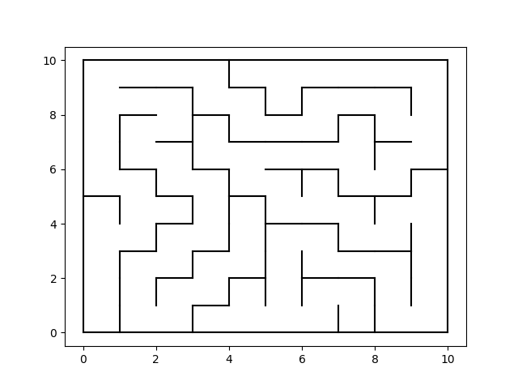

# Python Maze Generator
Generate a simple maze using the recursive backtracking algorithm

## How to Use
1. ```$ pip install numpy```
2. ```$ pip install matplotlib```
3. `python main_maze.py`

## Configuration
- Set number of columns and rows of the maze matrix 
- Default parameters: L_width = 10, L_height = 10        

